# Yoga World
## Overview
With so many options in the fitness and welbeing sector these days its hard to stand out. And with everyone out there pushing their
own personal ideas this was all about bringing it back to basics and what yoga stands for in general. The idea was to create 
a simplistic but informative website that lets the user decide for themselves. We did not want to push information at them 
but instead give them a simple honest view of the yoga lifestyle and what the studio can provide.
## Description
This website is for a hypothetical yoga studio which aims to provide all the information about the services to new or existing participants.
It will do this by provinding informationon on the types of classes that are held, the 
schedule of the classes and a brief introduction and history of the instructors. All while using 
friendly and emotive imagery and colors.
## Wireframes
* [Desktop](assets/wireframes/desktop/Desktop.png)
* [Ipad](assets/wireframes/ipad/Ipad.png)
* [Mobile](assets/wireframes/mobile/Mobile.png)
## UX
### Strategy
This yoga studio caters for all demographics so it is aimed at everyone from college students to bussiness men and woman 
or why not just bring the whole family including the kids.
#### Bussiness Goals
* To have more intereaction on the website from contact enquiries.
* To provide a clean easy and attractive site for people thinking about attending yoga for the first time.
* To see more social media interaction as a result of the site or vice versa.
### User Stories
#### New Users
* As a new user, I would like to learn about the overall experiance I can expect should I attend the studio.
* As a new user, I would like to have a clearly labeled and easily accessible way to find the info I need.
* As a new user, I would like a way to contact the studio should I have a query
* As a new user, I would like a way to book a class if im happy with the info ive recieved from the site.
* As a new user, I would like the site to be responsive to all screen sizes.
* As a new user, I would like to see the studio address clearly stated.
* As a new user, I would like to find the studios social media.
### Returning User
* As a returning user, I would like the site to stay consistent in regards layout. 
* As a returning user, I would like to know the schedule will be updated if there is any changes.
* As a returning user, I would like a direct link to access social media links fast and easy.
### Structure
The site is seperated with 4 different pages. The home page, schedule page, our team page and contact page.
The nav and footer will provide links to each page clearly labeled so theres no confusion on where to find the
information thats wanted. The address will be in the nav and footer along with the social media links in the footer, both will stay consistent
throughout the site. All pages will have informative info along with inviting colors and images throughout.
### Surface
#### Images
Each image was selected to give an honest representation of what the user can expect should they visit the studio. 
Include images of the instructors is to help first time users more comfotable before attending having seen an image 
and a brief piece of info about them.
#### Colurs
The maine colour in this website is green (#32a852). This was chosen to give a relaxing earthly feel which encompasses yoga
and tries to immediately put the user at ease.
#### Typography
In this site Acme and Cuprum are used to immediately catch the users eye in the site title and nav pages.

## Features

#### Navbar
* The navbar will have the studio name and address as well as all the sites pages clearly
 named in way that best describes what it contains so the user knows exactly where they need to go 
 for the info they want.
 
 #### Footer
 * The  footer will again contain the studio name and address, as well as all the social media links related to 
 the studio to allow the user to have another way to get a feel for the studio and access there social media content.
 It will also have the names and links to the other pages so the user doesnt not need to scroll back to the top preventing any confusion.
 
 #### Home Page
 * The home page will have an opening hero image with a quote and a "contact now" button linking to the contact page.
 Below that it will go through the list of classes available using a combination of images and text.
 * Header and footer remain the same as stated.
 
 #### Schedule Page
 * The schedule page will contain a table showing the user what class is being held and who the instructor is on each given day and time.
 * Header and footer remain the same as stated.
 
 #### Our Team Page
 * This page will contain and image of each instructor accompanied by a brief bit of text to give the user some info about them.
 * Header and footer remain the same as stated.
 
 #### Contact Page
 * This page will contain a single contact form so the user can ask any queries they might have before attending the studio.
 * Header and footer remain the same as stated.
 
 ## Features left to implement
 * You may notice in my wireframe and even in git commits that a book form was added. As I went to create 
 this form i realised it was out of the scope of the course at this point so this would be a future feature left to implement.
 * As well as the book form the functionality of the send button for the forms would also be needed to implement.

### Technologies Used
#### Lnaguages
* HTML
* CSS
#### Framworks, Libararies & Tools
* [GitHub](http://github.com)
* [Balsamiq](http://balsamiq.com)
* [Unsplash](https://unsplash.com/)
* [FontAwesome](https://fontawesome.com/)
* [GitPod](https://www.gitpod.io/)
* [Bootstrap](https://getbootstrap.com/)
* [Pexels](https://pexels.com/)

## Testing 
### Lighthouse Testing 
* Home Page: Desktop
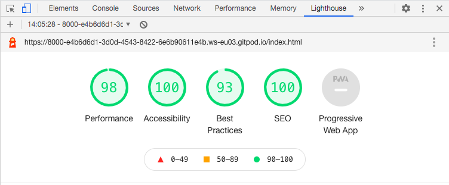
* Home Page: Mobile
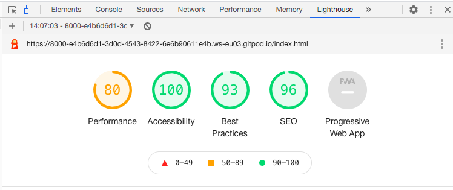

* Schedule Page: Desktop
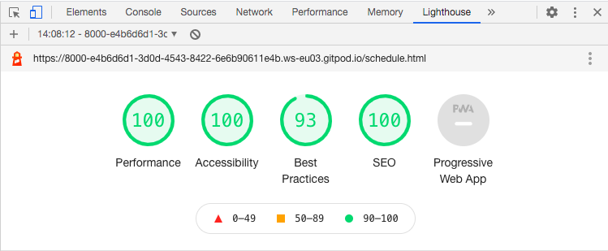
* Schedule Page: Mobile
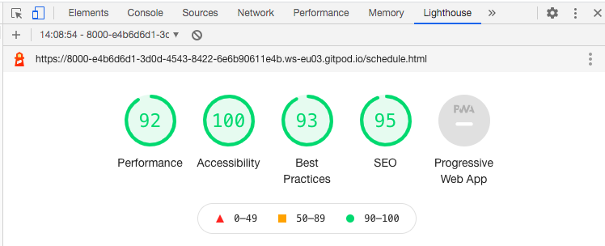

* Team Page: Desktop
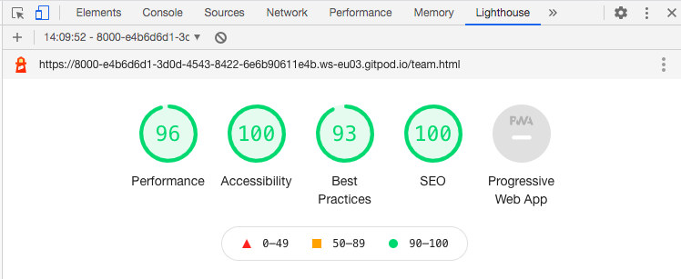
* Teamm Page: Mobile

* Contact Page: Desktop
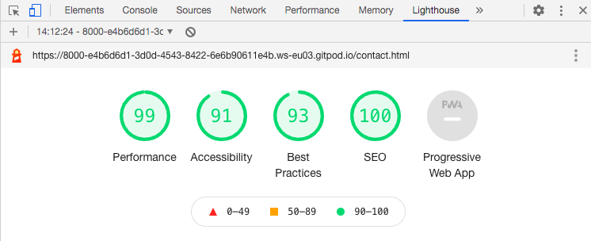
* Contact Page: Mobile
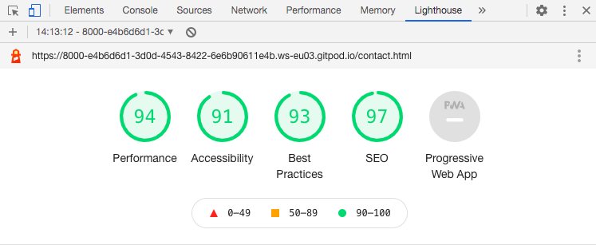

### Validation Testing 
#### HTML / [W3C](https://validator.w3.org/)
* Home Page: Button tag was removed instead using just href link and styled in css.
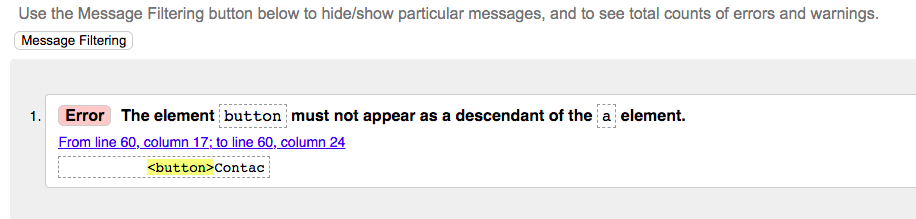
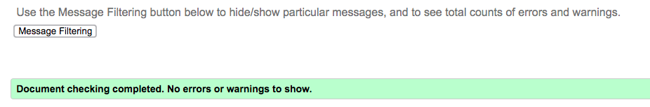

* Schedule Page: fixed-top was removed from nav element.
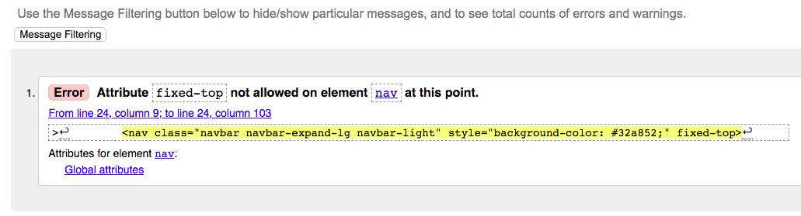
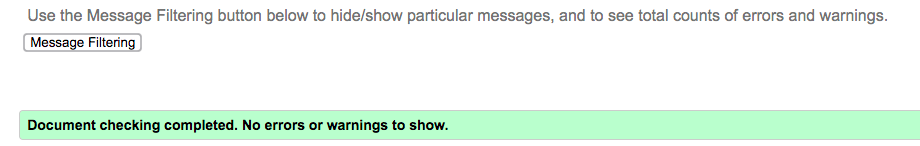

* Team Page: New image was added with appropriate name not leaving spaces like previous.
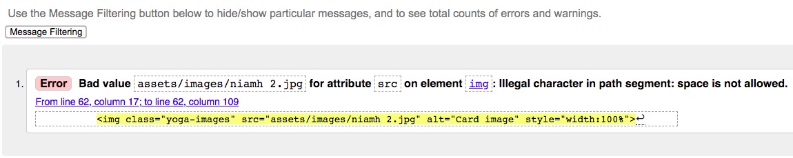
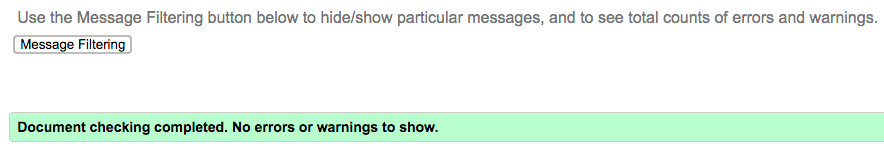

* Contact Page: Matched the "for" attribute in label with the with "id" attribute in textarea.
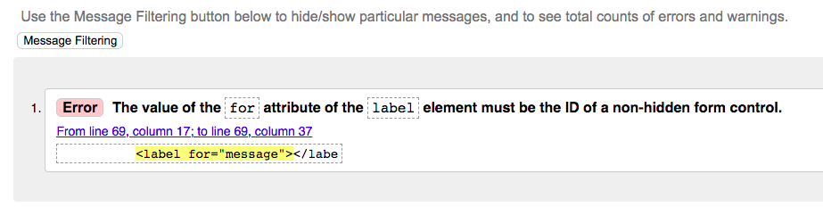
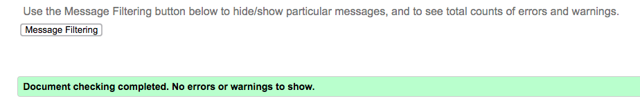

#### CSS / [W3C](https://jigsaw.w3.org/css-validator/)
* No issues reported
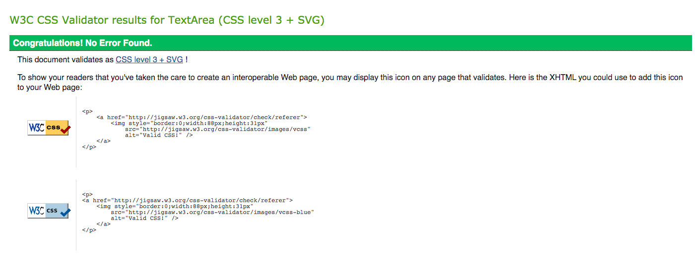

### Deployment 
## Credits
### Media
* All filler text was made up by me as hypotheticals for the website.

## Images
#### Home page
* Hero Image: (https://unsplash.com/photos/3RnkZpDqsEI) by (https://unsplash.com/@shotsbywolf)
* Beginners Image: (https://unsplash.com/photos/tjXI32qErO4) by (https://unsplash.com/@rishikeshyogpeeth)
* Intermediate Image: (https://unsplash.com/photos/Zp-FLjbXXGk) by (https://unsplash.com/@rishikeshyogpeeth)
* Advanced Image: (https://unsplash.com/photos/5JYYPsZWnz8) by (https://unsplash.com/@rishikeshyogpeeth)
* Family Friendly Image: (https://unsplash.com/photos/Vz0RbclzG_w) by (https://unsplash.com/@mister_a)

#### Our Team page
* Niamh Johnson image:(https://www.pexels.com/photo/people-woman-relaxation-girl-3758151/) by (https://www.pexels.com/@alexy-almond)
* Lauren Bruce image: (https://www.pexels.com/photo/woman-sitting-on-yoga-mat-2294352/) by (https://www.pexels.com/@823sl)
* John Deen image: (https://www.pexels.com/photo/man-in-black-crew-neck-t-shirt-and-black-pants-sitting-on-brown-wooden-floor-4327046/) by (https://www.pexels.com/@cottonbro)
* Tom Breen image: (https://www.pexels.com/photo/man-in-red-button-up-shirt-3777943/) by (https://www.pexels.com/@olly)
* Sarah Murphy image: (https://unsplash.com/photos/t1NEMSm1rgI) by (https://unsplash.com/@dane_aw)
* Mark Joyce image: (https://unsplash.com/photos/hyfRxVq9OUk) by (https://unsplash.com/@yogagenapp)

### Code Snippets
* Code for the team section with instructors was taken from (https://www.youtube.com/watch?v=gCPWMXC1ZDc) including the css styling elements.
* The navbar code was taken from [Bootstrap](https://getbootstrap.com/) and edited with the help of [Divinector-YouTube](https://www.youtube.com/watch?v=sbf3uv0reTc&t=475s)
* [System 22 I.T. Solutions-YouTube](https://www.youtube.com/watch?v=PwN0KVIrbA8&t=851s) was used to help with the creation of the footer.

### Acknowledgments 
* I recieved inspiration for this project from the Code Institute Love Running exercise.

 